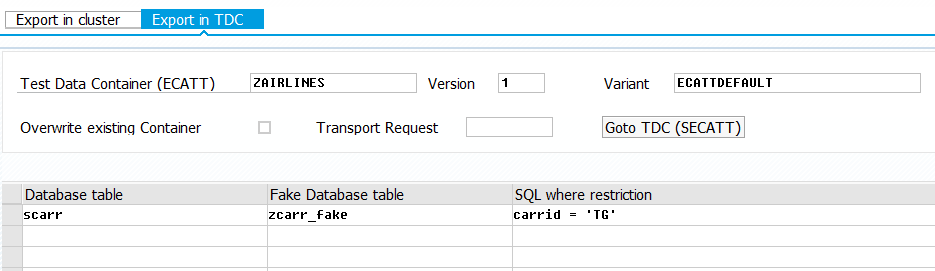

# ABAP Database preparator #
Database preparation made simple.

## Introduction ##
Automated testing (ABAP unit) requires a predefined environment.
The database records are part of this environment.
If database records are modified, tests can fail.

ABAP comes since release 7.52 with a replacement service for OpenSQL (class `cl_osql_replace`)
and for ABAP-CDS (class `cl_cds_test_environment`).
These replacement services provide predefined database records.
Preparing huge tables like `mseg` can be quite annoying.
This repository makes the setup of the replacement services more easy. 

## How it works ##
The database records are bundled up in so called bundle.
This bundle can contain records from multiple tables and
is stored either in ECATT test data container
or in an cluster (binary MIME-object in transaction smw0).

### Export step ###
In the first step we can choose the database records,
which should be exported into the bundle.
The OpenSQL replacement service needs a so called fake table with the same
structure as the original table. From this fake table the database records are
read or they are written back in this fake table. In the export step we link
original and fake table as shown in the picture below.

*Figure 1 Export step for table scarr in program `zexport_gui`*
In figure 1 the original table is named `scarr`, the fake table `zcarr_fake`.

If you don't want to use the OpenSQL replacement service,
you can leave the fake table empty.

### Import step ###
In the ABAP unit-testclass the database records exported in previous step
can be imported in the fake table or in the original table, 
if the fake table was left empty.
The API for the import step is located in class `zimport_bundle_from_cluster`
for clusters or in class `zimport_bundle_from_tdc` for
ECATT test data container.

For testing Rfc-Client- or Rfc-Serverprograms or programs,
which interact through the [JSON Adapter for ABAP Function Modules](https://github.com/cesar-sap/abap_fm_json/)
a API is located in function-group `zimport_bundle`.

A example can be found in the listing below.
```ABAP
CLASS test_airlines DEFINITION FOR TESTING DURATION SHORT
  RISK LEVEL HARMLESS.
  
  PRIVATE SECTION.

    " activate replacement service	  
    METHODS setup.

    METHODS thai_should_be_found FOR TESTING.

ENDCLASS.

CLASS test_airlines IMPLEMENTATION.

  METHOD setup.

    DATA(db_preparator) = NEW zimport_bundle_from_tdc( tdc = 'ZAIRLINES'
      tdc_version = 1 variant = 'ECATTDEFAULT' ).
    db_preparator->replace_content_completly( ).
    COMMIT WORK AND WAIT.

    db_preparator->activate_osql_replacement( ).

  ENDMETHOD.

  METHOD thai_should_be_found.
    DATA: exp_airlines TYPE STANDARD TABLE OF scarr.

    exp_airlines = VALUE #( ( carrid = 'TG' carrname = 'Thai airways'
                              currcode = 'THB' url = 'https://thaiairways.com' ) ).

    SELECT * FROM scarr INTO TABLE @DATA(act_airlines).

    cl_abap_unit_assert=>assert_equals( exp = exp_airlines
      act = act_airlines ).

  ENDMETHOD.

ENDCLASS.
```

### Authorization ###
Modifying database records with the APIs in class `zimport_bundle_from_cluster` or 
in class `zimport_bundle_from_tdc` should only be possible in 
development systems, where 
dangerous ABAP unit-testclasses can be executed.

### Whitelist-check ###
Content of fake-tables listed in the whitelist can be completely
overriden. The whitelist is maintained in parameter
`ZIMPORT_REPLACE_WHITELIST` (transaction `stvarv`, table `tvarvc`).

## Terms ##

* Bundle: a collection of database records, which are stored outside
  of the database tables.
* Cluster: a MIME-object in transaction `smw0`, which contains the bundle
* TDC: abbreviation for ECATT test data container

## Cloning this repository ##
Cloning can be done with [abapGit](https://github.com/larshp/abapgit).
The code is backwards compatible until release 7.40. The replacement services
need higher releases (SAP NetWeaver 7.51 or 7.52).

## Further links ##
[Blog entry on SAP community network](https://blogs.sap.com/?p=1049057)
